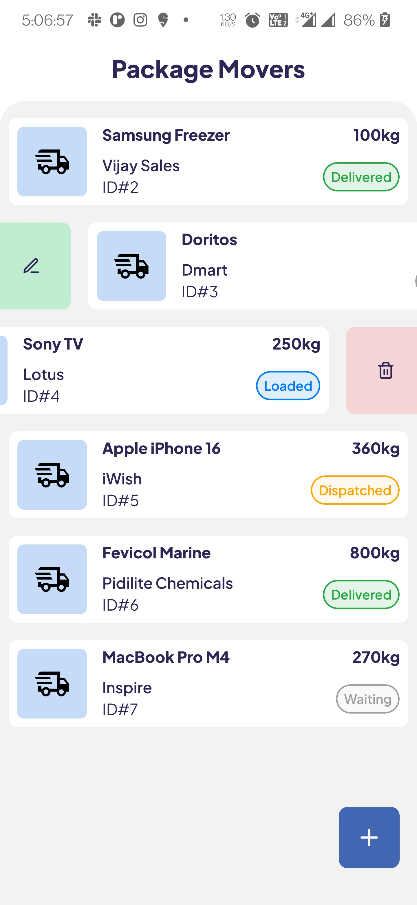
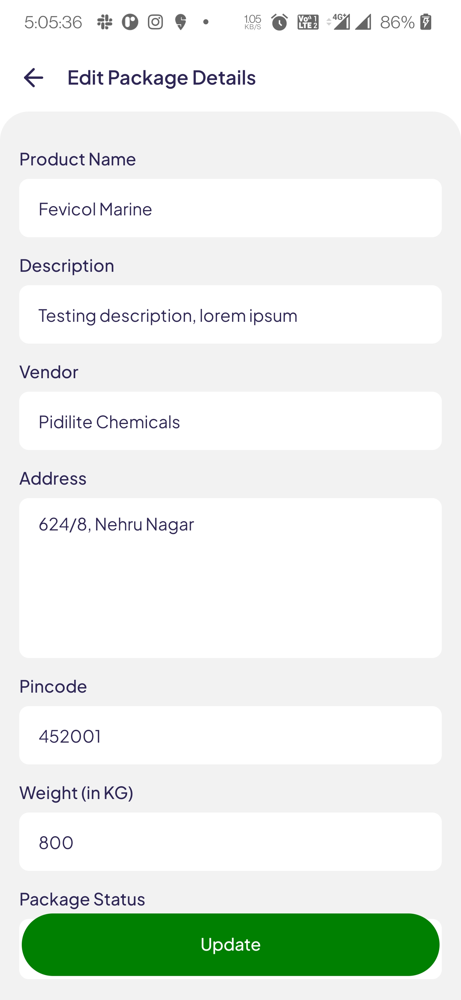
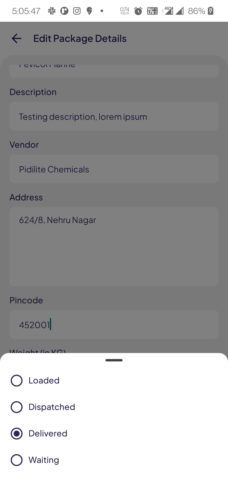
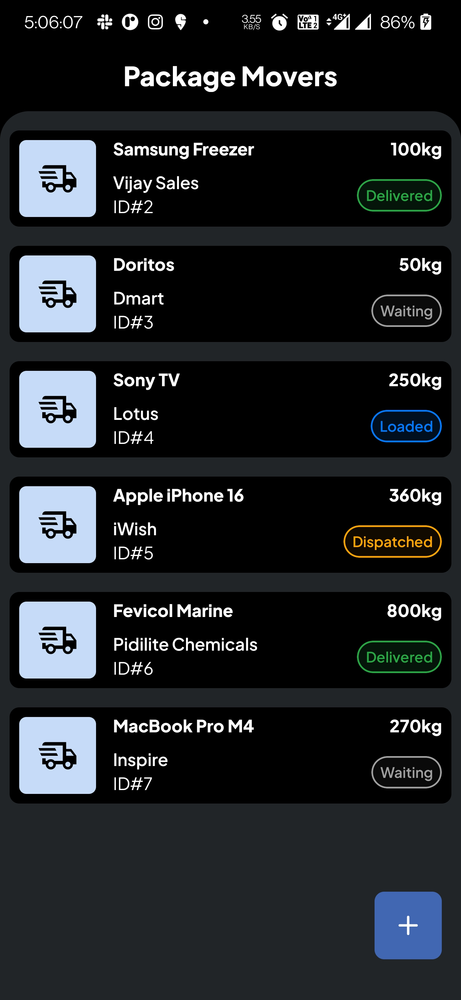
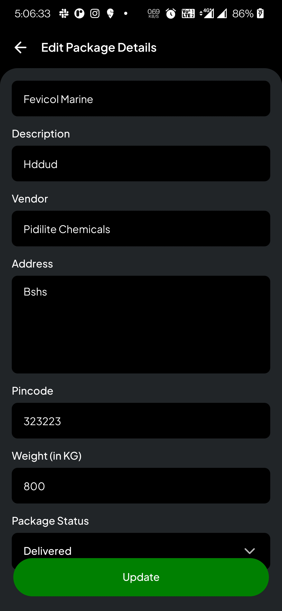

# 📱 Stantech React Native Assignment

This project is a mobile CRUD application built with **React Native CLI**, **Redux Saga**, and **SQLite** for local offline storage. The app demonstrates key engineering concepts including:

- Offline-first architecture  
- State management using Redux  
- Async flow with Redux Saga  
- SQLite integration for persistent storage  
- Clean, modular structure with functional components  

---

## 🖼️ Screenshots

<p align="center">
  
  
  
  
  
</p>

---

## 🚀 Features

- Create, read, update, and delete items
- Local SQLite database for persistence
- Redux + Saga for global state and side effects
- Dynamic bottom sheet to select package status
- Field validation and sanitation (pincode, weight)
- Clean UI with consistent structure

---

## 📦 Tech Stack

- React Native CLI
- Redux Toolkit + Redux Saga
- SQLite (`react-native-sqlite-storage`)
- Gorhom Bottom Sheet
- TypeScript (partially integrated due to time constraints)

---

## ⚙️ Getting Started

### 1. Clone the repo

```bash
git clone https://github.com/ItsAmanOP/StantechProject.git
cd StantechProject
